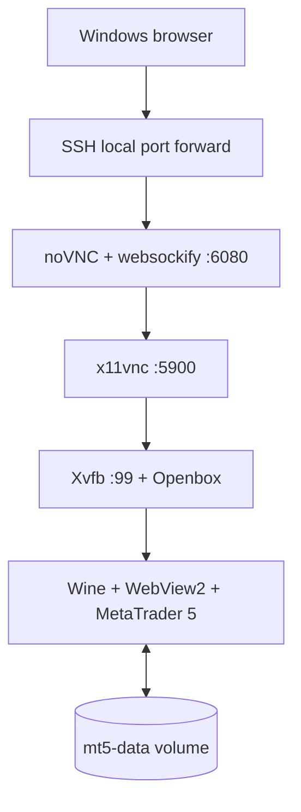
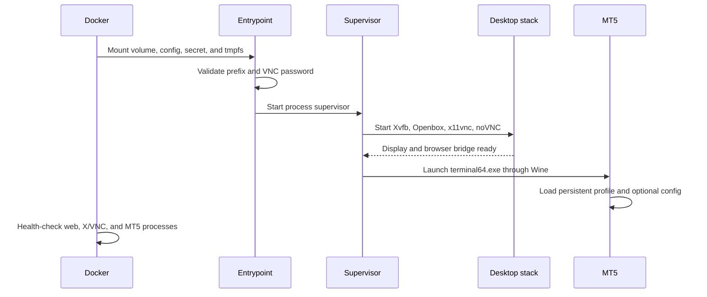

# Container architecture and improvement roadmap

This document explains how the image turns a Windows-only graphical trading
terminal into a persistent, browser-accessible service on a headless Linux VM.
The deployment intentionally uses one runtime container, but it still contains
several cooperating process and security layers.

## Design goals

- Run MetaTrader 5 on an amd64 Ubuntu host without a physical display.
- Keep all application dependencies inside one reusable image.
- Keep credentials and mutable terminal state outside the image.
- Expose the desktop only through host loopback by default.
- Make startup failures, terminal events, and health visible through Docker.
- Preserve a configuration surface that can be changed without editing the
  image.

## End-to-end data path

The browser never talks directly to Wine or MT5. It speaks WebSocket-based VNC
to noVNC/websockify. Websockify bridges that stream to x11vnc, which captures
the virtual X display where Wine renders MT5. The default SSH tunnel protects
the otherwise legacy VNC authentication layer and keeps port `6080` off the
external network.

## What each layer contributes

| Layer | Components | Contribution |
| --- | --- | --- |
| Host | Ubuntu VM, Docker Engine, Compose plugin | Supplies the Linux kernel, namespaces, networking, volumes, and lifecycle controls. No host GUI or Wine packages are needed. |
| Deployment | `compose.yaml`, `.env`, file mounts | Connects ports, volume, secret, configuration, tmpfs, health policy, log rotation, and security options without rebuilding. |
| Base image | Ubuntu 24.04 amd64 | Provides a predictable userspace and package ecosystem independent of the host's Ubuntu release. |
| Windows compatibility | WineHQ Staging plus 32-bit architecture support | Translates Windows API calls and runs both the MT5 terminal and its installer on Linux. |
| Embedded browser | Microsoft WebView2 | Supports MT5 screens and authentication flows that depend on an embedded Chromium runtime. |
| Virtual desktop | Xvfb | Creates an in-memory X11 display on a server with no physical monitor. |
| Window management | Openbox | Positions, focuses, and decorates MT5 windows inside the virtual desktop. |
| VNC bridge | x11vnc | Captures the Xvfb display and converts keyboard, pointer, and framebuffer activity to RFB/VNC. It listens only on container loopback. |
| Browser bridge | noVNC and websockify | Provides the HTML client and converts browser WebSockets to the TCP VNC stream. |
| Process control | Tini and Supervisor | Tini handles container signals and zombie reaping. Supervisor starts, orders, observes, and restarts all desktop and MT5 processes. |
| Application | MetaTrader 5 | Provides the trading terminal, profiles, history, indicators, Expert Advisors, and broker login UI. |
| Persistence | Named volume `mt5-data` | Stores the complete Wine prefix, MT5 installation, saved account state, profiles, history, and journals across container replacement. |
| Configuration | `.env` and read-only `config/mt5.ini` | Separates deployment and optional MT5 startup settings from the immutable image. |
| Observability | Docker health check, Supervisor output, Python journal forwarder | Reports process availability and forwards MT5/EA/tester journals as structured JSON lines. |
| Security | Non-root UID, read-only root filesystem, dropped capabilities, loopback bind | Reduces the effect of a process compromise and avoids direct VNC exposure. |

## Image build layers

The following are Docker image layers, not separately deployed services.

| Build layer | Contents | Why it is separated |
| --- | --- | --- |
| 1. Base | `ubuntu:24.04` | Establishes the ABI and package source baseline. |
| 2. System and Wine dependencies | WineHQ repository, amd64/i386 Wine libraries, X11, noVNC, fonts, Supervisor, Tini, Python | The largest Linux dependency layer can be cached when only scripts or documentation change. |
| 3. Runtime identity | `trader` user and group at UID/GID `10001` | Keeps the application non-root and avoids Ubuntu 24.04's occupied ID `1000`. Explicit collision checks fail early. |
| 4. Runtime control files | Entrypoint, process launchers, health check, journal forwarder, Supervisor configuration | Keeps operational logic reviewable and replaceable without repeating package installation. |
| 5. Seeded application state | Wine prefix, WebView2, and MT5 installation | Creates a ready-to-run image. Docker copies this seed into a new named volume on first use. |
| 6. Runtime contract | Port, volume, health check, Tini entrypoint | Declares how the image is expected to be operated. |

The installers are downloaded during the build and are not stored in this
repository. Optional SHA-256 variables can pin their exact bytes. Because the
upstream endpoints are evergreen, leaving the pins blank improves update
convenience but reduces reproducibility.

## Startup sequence

Supervisor priorities start the virtual display before the processes that use
it. The launcher scripts also wait for X to become responsive, preventing a
short startup race from turning into a permanent failure.

## Persistence model

The image contains a seeded Wine prefix under `/home/trader/.mt5`. On the first
container creation, Docker initializes the empty named volume from that image
directory. After that point, the volume is authoritative:

- Recreating or upgrading the container preserves saved login state and MT5
  data.
- Rebuilding the image does not automatically replace files already present in
  an existing volume.
- A new volume is required to test a completely fresh installer seed.
- `docker compose down` is safe; `docker compose down -v` deletes the state.

The reusable image deliberately contains no runtime broker credentials. Moving
an image and moving a logged-in terminal state are separate operations.

## Configuration boundaries

| Input | Applied when | Typical use |
| --- | --- | --- |
| Docker build arguments | Image build | Installer URLs/checksums and internal UID/GID |
| `.env` | Compose render/container creation | Ports, display size, timezone, image/volume names, log behavior |
| `config/mt5.ini` | Each terminal start | Optional MT5 startup settings and safe policy defaults |
| MT5 GUI | Runtime | Broker login, charts, profiles, indicators, and account-specific preferences |
| Named volume | Across starts | All mutable Wine and MT5 state |

Secrets should not be placed in `.env`. Interactive broker login is preferred
because environment variables are inspectable and an external INI file is easy
to copy accidentally.

## Health and observability

The Docker health check verifies three independent paths:

1. noVNC serves `vnc.html` on container loopback.
2. Xvfb and x11vnc processes exist.
3. the MT5 `terminal64.exe` process exists under Wine.

This detects process and endpoint loss, but it cannot prove successful broker
authentication, market-data freshness, order execution, or trading strategy
correctness. Those require application-level monitoring and broker-aware test
logic.

The log forwarder discovers current MT5, MQL5, tester, and crash journals,
decodes UTF-8/UTF-16 content, emits JSON, and redacts obvious password fields.
Account numbers, strategy names, trade information, and broker details can
still appear and must be treated as sensitive operational data.

## Security boundaries and tradeoffs

- Browser access is bound to `127.0.0.1`; SSH supplies encryption and host
  authentication.
- VNC/RFB passwords use only eight effective characters. They are not suitable
  as a public-internet control by themselves.
- All runtime processes use the unprivileged `trader` account. Linux
  capabilities are dropped and privilege escalation is disabled.
- The root filesystem is read-only. Writes are limited to the MT5 volume and
  tmpfs mounts.
- One container intentionally contains multiple tightly coupled GUI processes.
  Supervisor is necessary because the user requirement is a single deployable
  container rather than one container per Unix process.
- One deployment should represent one trust boundary. Do not share one GUI and
  Wine prefix between mutually untrusted users.

## Improvement roadmap

| Priority | Improvement | Benefit | Cost or tradeoff |
| --- | --- | --- | --- |
| High | Pin the Ubuntu base digest and official installer SHA-256 values for releases | Reproducible builds and protection from silent upstream replacement | Requires an explicit update process whenever upstream publishes a new build |
| High | Generate an SBOM, scan with Trivy/Grype, and sign images with Cosign | Dependency visibility, vulnerability tracking, and provenance | Adds release infrastructure and triage work; proprietary binaries may have limited metadata |
| High | Encrypt backups and run scheduled restore tests | Protects saved account state and proves recoverability | Requires key management and protected backup storage |
| High | Add an authorized self-hosted amd64 release runner for full build and GUI smoke tests | Detects Wine, WebView2, installer, and browser regressions before deployment | Build is large and slow and downloads software with separate terms |
| Medium | Put noVNC behind an authenticated TLS reverse proxy when SSH is unsuitable | Central identity, certificates, audit logs, and safer shared access | Adds another service and must preserve WebSocket upgrades correctly |
| Medium | Export metrics for health, restart counts, journal error rates, disk use, and broker connectivity | Faster alerting and capacity planning | Requires application-specific rules to avoid false confidence |
| Medium | Add a broker/terminal compatibility matrix and canary volume | Safer Wine and MT5 upgrades | More storage and test effort; broker installers behave differently |
| Medium | Improve rootless-Docker and user-namespace support | Reduces host-daemon privilege | Bind-mounted file ownership and volume UID mapping become more complex |
| Medium | Add explicit cache-control headers for noVNC static assets | Prevents stale HTML/JavaScript combinations after upgrades | Requires a web-serving layer or a websockify enhancement |
| Low | Evaluate hardware-accelerated rendering | Can improve chart-heavy UI performance | Adds GPU device access, drivers, larger attack surface, and lower portability |
| Low | Add orchestration for one isolated deployment per trader/account | Better tenancy and independent lifecycle | Increases resource use and operational complexity |

The most valuable next step is a reproducible release pipeline with pinned
inputs, SBOM/signing, and a real end-to-end build on an authorized amd64 runner.
The most valuable production step is encrypted, routinely restored backup of
the `mt5-data` volume.
